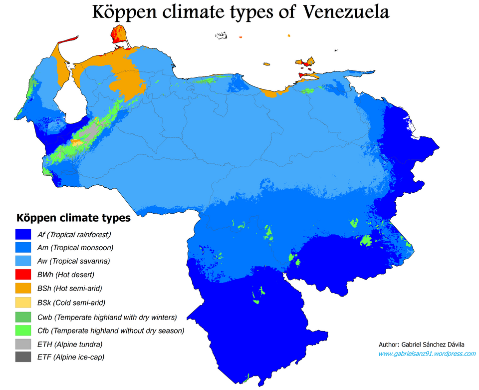
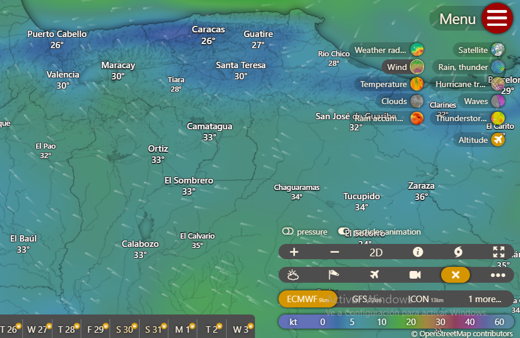
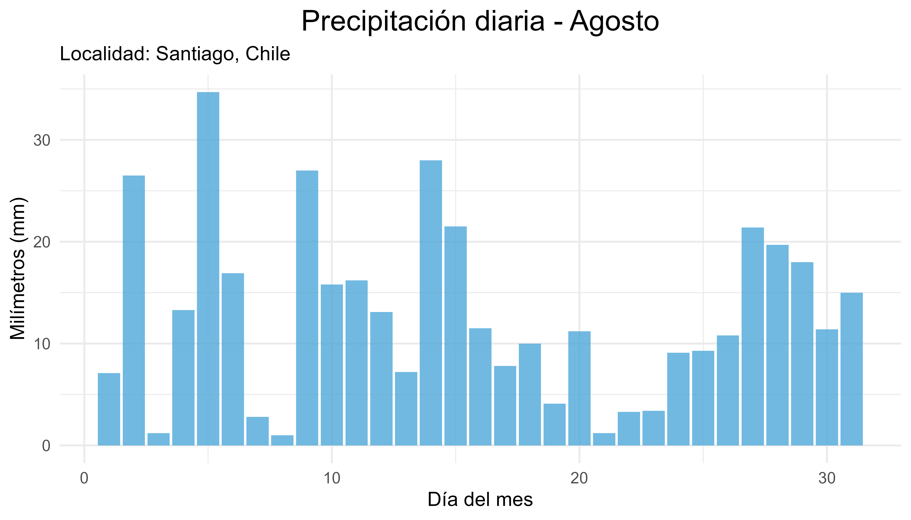
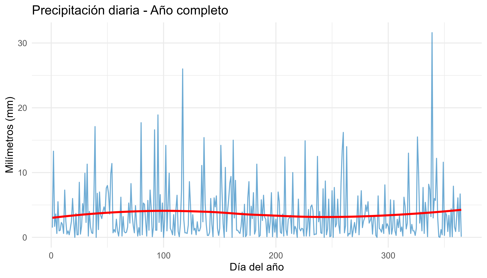
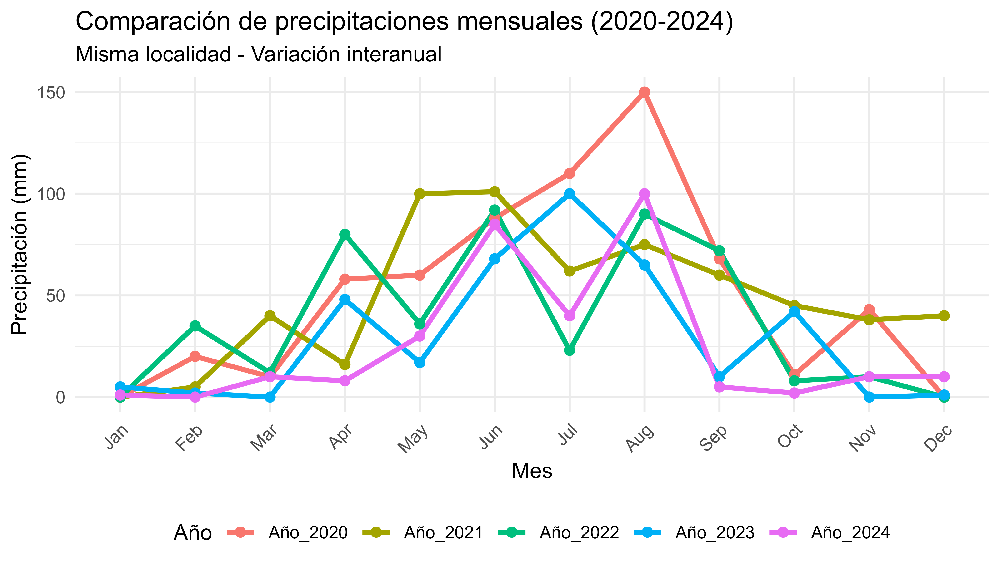
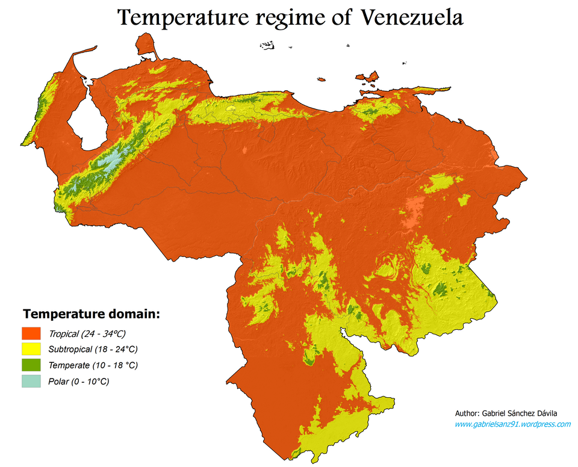

## Contenido

-El clima como parte del ambiente físico y su importancia

-Características del clima como recurso

-Usos agroambientales de la información climática: planificación estratégica, táctica y operativa

-Pasos para la aplicación de información climática; medición y procesamiento

-Integración con la información sobre la aplicación

## Personal docente

Prof. Miguel Silva

Prof. Naghely Mendoza

## Estructura de la asignatura

\-**Tema 1.** Introducción y conceptos básicos

\-**Tema 2.** Radiación y Balance energético

\-**Tema 3.** Temperatura

\-**Tema 4.** Evaporación y Evapotranspiración

\-**Tema 5.** Precipitación y régimen hídrico

\-**Tema 6.** Aplicaciones de la climatología

## Los sistemas de producción agrícola y los ecosistemas naturales

<small> No dependen de un solo factor, sino de la interacción entre varios componentes del ambiente y de la acción humana. </small>

-   🌱 **Suelo** - 🖐️ **Prácticas de manejo**
-   🌍 **Ambiente físico** - 🌳 **Ecosistemas naturales**
-   🦠 **Agentes bióticos** - 💰 **Aspectos socioeconómicos**
-   ⚙️ **Tecnología** - 🧬 **Potencial genético de la variedad o raza**

<small> La climatología agroambiental no estudia solo el clima como dato meteorológico, sino cómo ese clima se relaciona con el funcionamiento real de los sistemas productivos y naturales. </small>

## ¿Conceptos fundamentales? 🤔 ⁉️ {.center}

## 

::::: columns
::: {.column width="50%"}
**Tiempo meteorológico**

</small> </small> Condición de la atmósfera en un momento particular definida por el comportamiento de los elementos climáticos en ese momento </small> </small>

:::

::: {.column width="50%"}
**Clima**

</small> </small> Descripción estadística del tiempo meteorológico en términos de sus valores medios y de la variabilidad de sus magnitudes durante períodos que pueden abarcar desde meses hasta millares o millones de años (IPCC, 2007) </small> </small>

:::
:::::

## Factores del clima

Son características de la superficie terrestre o condiciones de la atmósfera que modifican a los elementos climáticos

-   Latitud

-   Altitud

-   Cercanía a masas de agua

-   Topografía

-   Distribución de las masas de tierra y agua

-   Corrientes oceánicas

-   Centros de altas y bajas presiones

-   Masas de aire

## La agrometeorología

-   Estudia la acción mutua de las variables atmosféricas y la agricultura en su sentido más amplio.

-   Comprende desde la capa de suelo donde crecen las raíces mas profundas de árboles y plantas, pasando por la capa de aire próxima al suelo, en la que viven cultivos, árboles y animales, hasta alcanzar los más elevados niveles de la atmosfera en donde ocurren procesos como transporte y dispersión de polvo, semillas y polen.

## Necesidad de formación básica en agrometeorología

-   Conocimiento básico de los elementos climáticos y su efecto en el ambiente y la agricultura (cultivos y labores)

-   Conocimiento de las características generales del clima del país: de los patrones de sus elementos climáticos, de su variabilidad temporal y espacial

-   Manejo de métodos estadísticos para la evaluación del clima y uso de herramientas para el análisis de las consecuencias agrícolas y ambientales de las condiciones climáticas.

## El clima es un recurso pero tambien representa riesgos ⛈️☀️ 🌤️🌪️️{.center} 

## El Clima como recurso

-   Provee condiciones de radiación, temperatura y agua para la vida.

-   Determina los ciclos bioquímicos.

-   Determina la fotosíntesis y la respiración

-   Provee insumos para la actividad humana: agricultura, industria, doméstica, transporte, turismo, recreación.

-   Fuente de energía.

-   La atmósfera absorbe productos de desecho de las actividades económicas y sociales.

## El clima como una fuente de riesgo

-   Variaciones en los elementos climáticos a lo largo del año

-   Variaciones en los elementos entre años

-   Variaciones en fechas de inicio y término de los períodos húmedos

-   Eventos extremos:Lluvias, Sequias, Vientos, Olas de calor o de frío

-   Cambio climático

## Particularidades del clima como recurso

-   Estamos familiarizados con la idea de recursos para la producción que se manejan a través de la aplicación de insumos, o del mejoramiento genético, no obstante..

-   Se trata de un recurso generalmente no “controlable” en el sentido tradicional.

-   Manejar el recurso clima, implica tomar decisiones estratégicas, tácticas y operativas para armonizar la oferta y las limitaciones climáticas con los requerimientos climáticos.

## Podemos abordar esta variabilidad a través del mecanismo análogo al enzima-sustrato:

- Enzima = Oferta = Clima

- Sustrato = Demanda = Requerimientos de cultivos, plagas y labores

.jpg)

## ¿Qué significa esta analogía? {.center}

## 1. El clima (enzima) actúa sobre los cultivos (sustrato)

**Así como una enzima transforma un sustrato, el clima:**

- Transforma el cultivo (lo hace crecer, florecer, producir)

- Actúa sobre las plagas (favorece o limita su desarrollo)

- Condiciona las labores agrícolas (cuándo se puede sembrar, cosechar, etc.)

## 2. Hay una relación de "ajuste" o "complementariedad"

**En bioquímica, la enzima y el sustrato deben encajar (como llave y cerradura):**

**En agricultura:**

- Clima ideal + Cultivo bien adaptado = Buena producción ✅

- Clima extremo + Cultivo sensible = Mala producción ❌

- Clima variable + Plaga adaptada = Problema sanitario 🐛

## 3. La variabilidad climática afecta el "acople"

**Si el clima (enzima) cambia:**

- Ya no "encaja" bien con los requerimientos del cultivo (sustrato)

- Se altera el momento, intensidad o duración de las reacciones (fenología, crecimiento)

## A través de la armonización entre la oferta y la demanda climática se busca:

-   Maximizar rendimientos

-   Mejorar el uso de recursos

-   Reducir Riesgos

-   Reducir costos

-   Reducir daños ambientales

## Particularidades del clima como recurso para la producción agrícola

-   En muchas áreas de la agronomía se acostumbra resumir los datos utilizando el promedio 🛑 ❌

-   Debido a su gran variabilidad espacial y temporal.

-   Los profesionales tienen que ser formados para que analicen el clima en términos de probabilidad y para que comprendan que dicha variabilidad es una fuente muy importante de riesgo agrícola. ✅

## Las condiciones atmosféricas varían en diversas escalas temporales 📊 📈 📋 {.center}

## Variación a corto plazo

## Variación a largo del año

## Variacion interanual

## Variacion espacial

##  {.center}

**Variabilidad climática:**

Variaciones del estado medio y otras características estadísticas (desviación típica, sucesos extremos, etc.) del clima en todas las escalas espaciales y temporales más amplias que las de los fenómenos meteorológicos (IPCC, 2023)

## Entonces, la arquitectura de la información para la gestión agrícola debe ser ➡️ {.center}

##

::::: {style="display: flex; justify-content: center; gap: 50px; margin-bottom: 30px;"}
<!-- Rama izquierda: Datos climáticos -->

::: {style="background: #E3F2FD; border: 2px solid #1E88E5; border-radius: 10px; padding: 20px; width: 40%; text-align: center; font-size: 25px;"}
<strong style="font-size: 25px;">📊 Datos climáticos</strong>    Radiación, Fotoperíodo,  Insolación, Temperatura,  Precipitación, Evaporación, Viento
:::

<!-- Rama derecha: Datos agronómicos -->

::: {style="background: #E8F5E9; border: 2px solid #43A047; border-radius: 10px; padding: 20px; width: 40%; text-align: center; font-size: 25px;"}
<strong style="font-size: 25px;">🌱 Datos agronómicos y ambientales</strong>    Cultivo, Suelo, Labores, Pendiente,  Relieve, Plagas, Enfermedades
:::
:::::

<!-- Flechas que bajan desde ambas -->

::::: {style="display: flex; justify-content: center; gap: 50px; margin-bottom: 20px;"}
::: {style="width: 40%; text-align: center; font-size: 25px;"}
⬇️
:::

::: {style="width: 40%; text-align: center; font-size: 25px;"}
⬇️
:::
:::::

<!-- Caja de unión -->

:::: {style="display: flex; justify-content: center; margin-bottom: 20px;"}
::: {style="background: #FFF3E0; border: 2px solid #FB8C00; border-radius: 10px; padding: 15px; width: 60%; text-align: center; font-size: 25px;"}
<strong style="font-size: 25px;">ℹ️ Información con fines agrícolas y ambientales</strong>
:::
::::

<!-- Flecha hacia abajo -->

:::: {style="display: flex; justify-content: center; margin-bottom: 20px;"}
::: {style="font-size: 24px;"}
⬇️
:::
::::

<!-- Caja final -->

:::: {style="display: flex; justify-content: center;"}
::: {style="background: #FFEBEE; border: 3px solid #E53935; border-radius: 10px; padding: 20px; width: 60%; text-align: center; font-weight: bold; font-size: 25px;"}
🎯 <strong>TOMA DE DECISIONES</strong>
:::
::::

## Pasos para la aplicación de la información climática ➡️ {.center}

##

:::::::::::::: {style="display: flex; flex-direction: column; align-items: center; gap: 15px;"}
<!-- Caja 1: Datos brutos -->

::: {style="background: #E3F2FD; border: 2px solid #1E88E5; border-radius: 10px; padding: 15px; width: 40%; text-align: center; font-size: 16px;"}
<strong style="font-size: 21px;">📋 Datos brutos</strong>  Datos estimados, Datos generados, Medición
:::

::: {style="font-size: 20px;"}
⬇️
:::

<!-- Caja 2 y 3: Bases de datos (lado a lado) -->

::::: {style="display: flex; justify-content: center; gap: 30px; width: 100%;"}
::: {style="background: #E3F2FD; border: 2px solid #1E88E5; border-radius: 10px; padding: 15px; width: 35%; text-align: center; font-size: 20px;"}
<strong style="font-size: 21px;">🌡️ Bases de datos climáticos</strong>
:::

::: {style="background: #E8F5E9; border: 2px solid #43A047; border-radius: 10px; padding: 15px; width: 35%; text-align: center; font-size: 20px;"}
<strong style="font-size: 21px;">🗄️ Bases de datos agroambientales</strong>
:::
:::::

<!-- Flechas desde ambas -->

::::: {style="display: flex; justify-content: center; gap: 30px; width: 100%;"}
::: {style="width: 35%; text-align: center; font-size: 20px;"}
⬇️
:::

::: {style="width: 35%; text-align: center; font-size: 20px;"}
⬇️
:::
:::::

<!-- Caja de unión: Procesamiento -->

::: {style="background: #FFF3E0; border: 2px solid #FB8C00; border-radius: 10px; padding: 15px; width: 50%; text-align: center; font-size: 16px;"}
<strong style="font-size: 21px;">⚙️ PROCESAMIENTO Control de calidad</strong>
:::

::: {style="font-size: 20px;"}
⬇️
:::

<!-- Caja final -->

::: {style="background: #FFEBEE; border: 3px solid #E53935; border-radius: 10px; padding: 15px; width: 70%; text-align: center; font-size: 20px;"}
<strong style="font-size: 21px;">🎯 INFORMACIÓN CON FINES AGRÍCOLAS Y/O AMBIENTALES</strong>
:::
::::::::::::::

## Usos de la Información con fines agrícolas y/o ambientales

-   Planificación estratégica (tiene consecuencias en el largo plazo)

-   Planificación Táctica (consecuencias involucran una estación o un ciclo de cultivo)

-   Planificación operativa (tiene consecuencias en el corto plazo)

-   Interpretación de resultados experimentales

## Usos de la Información con fines agrícolas y/o ambientales

<table style="width: 100%; border-collapse: collapse; font-size: 18px; border: 1px solid #aaa;">
  
  <tr style="background: #f0f0f0;">
    <th style="border: 1px solid #aaa; padding: 12px;">Tipo de uso</th>
    <th style="border: 1px solid #aaa; padding: 12px;">Datos climáticos requeridos</th>
    <th style="border: 1px solid #aaa; padding: 12px;">Productos</th>
    <th style="border: 1px solid #aaa; padding: 12px;">Actividades que apoya</th>
  </tr>
  
  <tr style="vertical-align: top;">
    <td style="border: 1px solid #aaa; padding: 10px;">
      <strong>Planificación Estratégica</strong> 
      Consecuencias a largo plazo
    </td>
    <td style="border: 1px solid #aaa; padding: 10px;">Registros largos (> 20 años)</td>
    <td style="border: 1px solid #aaa; padding: 10px;">Valores probables, promedio, fluctuaciones, valores extremos, períodos de retorno</td>
    <td style="border: 1px solid #aaa; padding: 10px;">
      Selección de especies • Zonificación de cultivos • Uso y manejo de la tierra • Selección de sistemas de labranza • Diseño de infraestructura • Calendarios agrícolas
    </td>
   </tr>
  
  <tr style="background: #f9f9f9; vertical-align: top;">
    <td style="border: 1px solid #aaa; padding: 10px;">
      <strong>Planificación Táctica y Operativa</strong> 
      Consecuencias a corto plazo
     </td>
    <td style="border: 1px solid #aaa; padding: 10px;">Situación actual + pronóstico + registro histórico + pronóstico climático</td>
    <td style="border: 1px solid #aaa; padding: 10px;">Pronóstico y recomendación para próximas horas</td>
    <td style="border: 1px solid #aaa; padding: 10px;">
      Decisión de siembra y cosecha • Control de temperatura y humedad • Operación de riego
     </td>
   </tr>
  
  <tr style="vertical-align: top;">
    <td style="border: 1px solid #aaa; padding: 10px;">
      <strong>Investigación</strong> 
      Generación de nuevos conocimientos
     </td>
    <td style="border: 1px solid #aaa; padding: 10px;">Medidos en el lugar de ensayo + registros</td>
    <td style="border: 1px solid #aaa; padding: 10px;">Descripción de condiciones del ensayo y comparación</td>
    <td style="border: 1px solid #aaa; padding: 10px;">Comprensión de procesos y relaciones</td>
   </tr>
  
</table>

## Asi entonces..

La información climática es una entrada importante para el diseño, desarrollo y sostenibilidad de un amplio rango de actividades en diversos sectores socio económicos:

-   Agricultura
-   Planificación urbana
-   Manejo de recursos energéticos y agua
-   Transporte
-   Turismo
-   Operación de infraestructura

##  {.center}

**Sesiones prácticas**

- Fuentes de datos meteorológicos 

- Control de calidad de datos meteorológicos 

